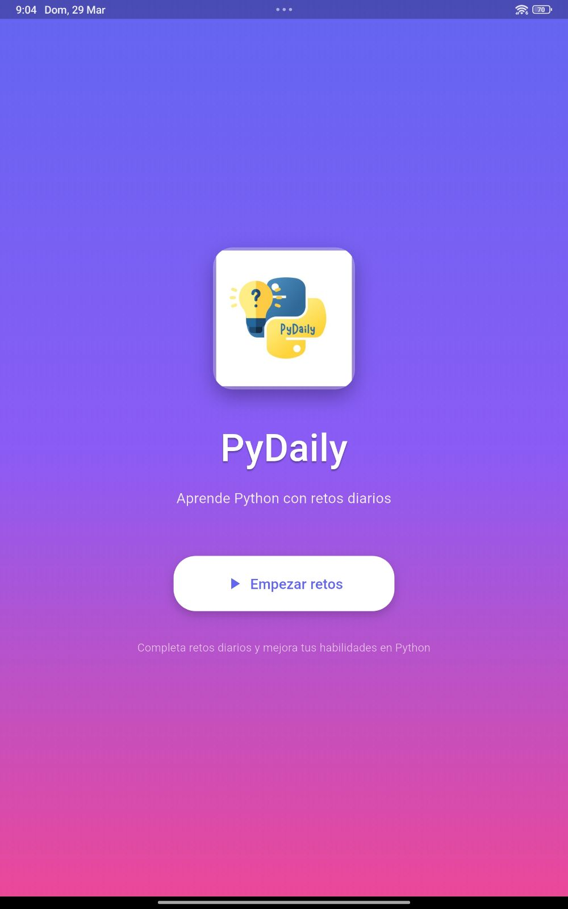
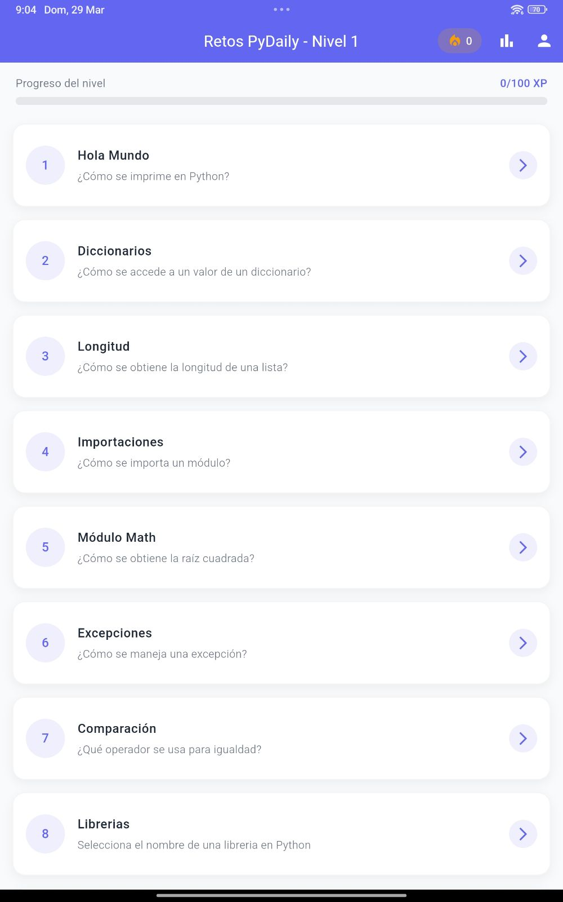
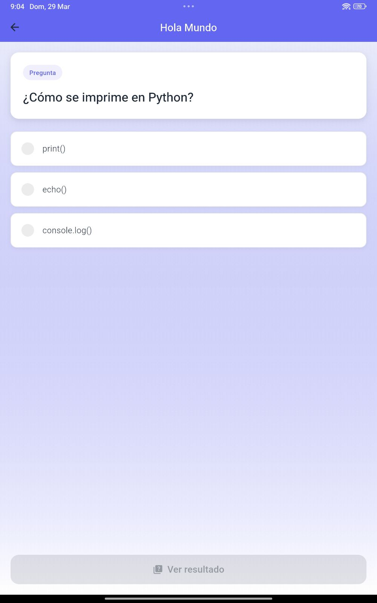
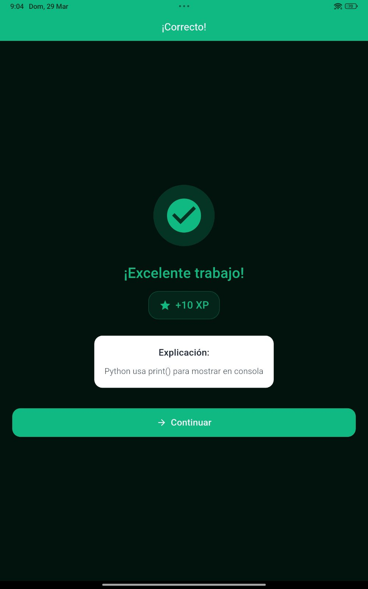
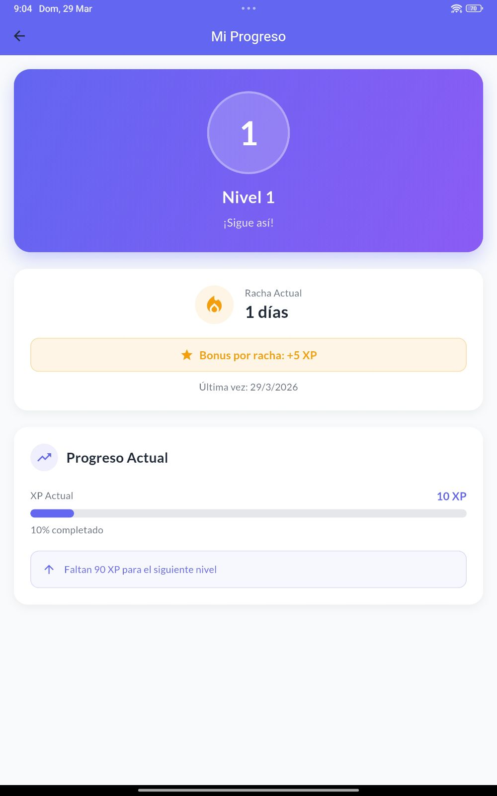
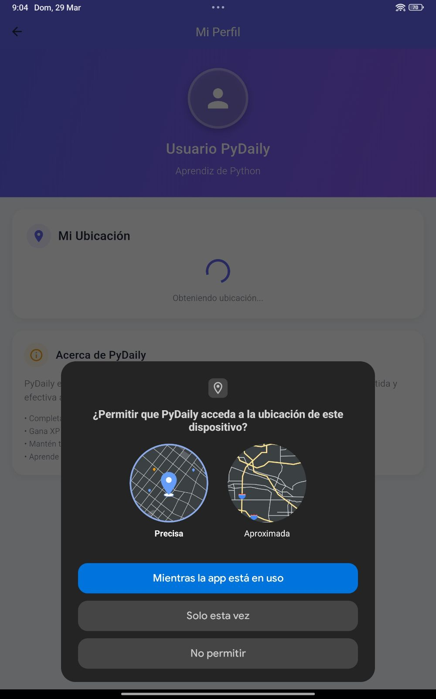

# PyDaily - App de aprendizaje de Python | Flutter, Firebase
* Aplicación móvil enfocada en el aprendizaje de Python mediante ejercicios diarios interactivos.
* Implementa un sistema de quizzes con retroalimentación inmediata para reforzar el aprendizaje del usuario.
* Integración con Firebase para autenticación de usuarios, gestión de datos en tiempo real y uso de APIs de Google.

## 📸 Capturas

  <strong>🏠 Inicio</strong> 
  

  <strong>📱 Pantalla principal</strong> &nbsp;&nbsp;&nbsp;&nbsp;
  <strong>🧠 Quiz</strong> &nbsp;&nbsp;&nbsp;&nbsp;
  <strong>📊 Resultados</strong>

  
  
  

  <strong>📈 Estadísticas</strong> &nbsp;&nbsp;&nbsp;&nbsp;
  <strong>🔐 Perfil / APIs</strong>

  
  

